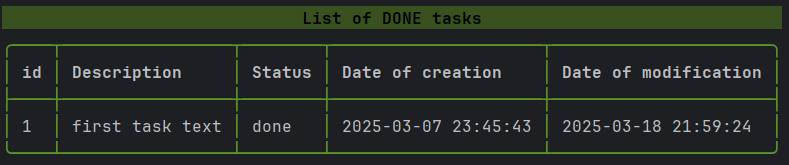

# Simple Task_tracker_cli

## Description:

Task tracker is a project used to track and manage tasks

## Features

- **Add, Update, and Delete tasks**
- **Mark a task as in progress or done**
- **List all tasks**
- **List all tasks that are done**
- **List all tasks that are not done**
- **List all tasks that are in progress**

## Usage

- **Add a task**

  

- **Update a task**

  
 
- **Mark a task as done**

  

- **Mark a task as in-progress**
  
  

- **Delete a task**

  

- **List tasks**
  
  
  

  
  

  
   

